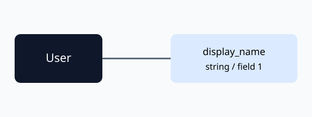

## Start with a message

A Protocol Buffers schema defines messages and their fields. Follow type references to understand the structure returned by an API.



### Field numbers

Names help readers; field numbers are part of the compatibility discussion.

```proto title="user.proto" {3}
syntax = "proto3";
message User {
  string display_name = 1;
}
```

## Further reading

https://github.com/ymmt2005/pbschema-lens

See the [Markdown showcase](../2026-09-20-markdown-showcase/en.md#code).
