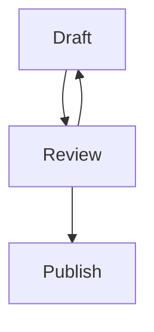
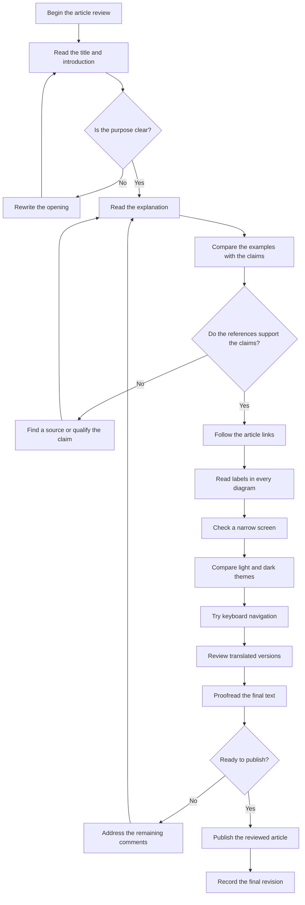
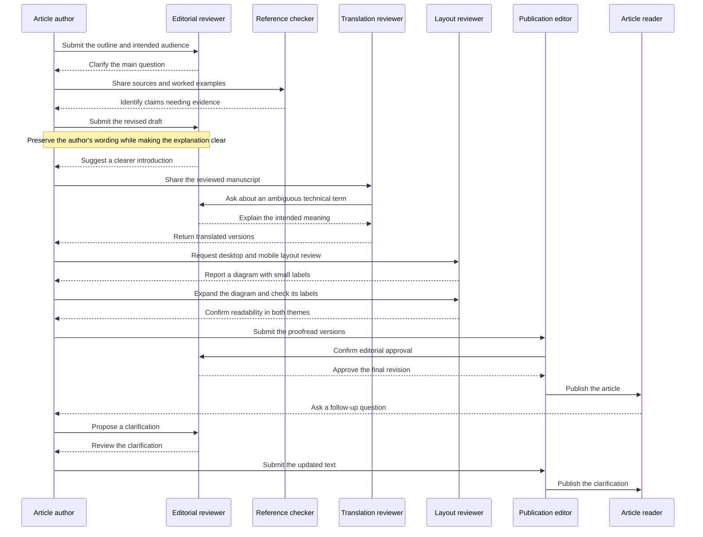

## Code

Check syntax highlighting, line highlighting, and the copy action. Copy the original text without line numbers or marker annotations.

```go title="main.go" {4-6} /Println/
package main
import "fmt"

func main() {
    fmt.Println("hello")
}
```

### A long line

Check that horizontal scrolling does not break the width of the whole page.

```text
0123456789 0123456789 0123456789 0123456789 0123456789 0123456789 0123456789 0123456789 0123456789 0123456789 0123456789
```

## Figures and alerts

Check Mermaid diagrams, alerts, tables, and footnotes.

> [!NOTE]
> This is a note.

> [!TIP]
> Copy the code with the keyboard too.

> [!IMPORTANT]
> Keep the original source in Git.

> [!WARNING]
> A preview is not automatically private.

> [!CAUTION]
> Review external embeds before publishing.

| Feature | State |
| --- | --- |
| Table | Ready |
| ~~Old label~~ | Replaced |

- [x] Write Markdown
- [ ] Review the preview

<details><summary>Raw HTML disclosure</summary><p id="html-anchor">A stable explicit HTML anchor.</p></details>




## Large Mermaid diagrams

These diagrams illustrate a fictional editorial process. Expand each diagram to read the labels, scroll to its far edges, and compare fit-to-window with actual size. Try zoom, full screen, a narrow screen, and both themes. Close the viewer or press Escape to return here.

The diagrams use the same English labels in every translation so their layout can be compared.

### A wide publishing workflow

```mermaid
flowchart LR
  Idea["Choose an article idea"] --> Outline["Write the outline"]
  Outline --> Research["Collect sources and examples"]
  Research --> Draft["Write the first draft"]
  Draft --> Review["Ask for an editorial review"]
  Review --> Revise["Revise the explanation"]
  Revise --> Check["Check facts and references"]
  Check --> Translate["Prepare translated versions"]
  Translate --> Proof["Proofread every version"]
  Proof --> Layout["Review the page layout"]
  Layout --> Publish["Publish the article"]
  Publish --> Archive["Keep the reviewed manuscript"]
```



### A tall review checklist



### A detailed editorial conversation



An inline [ordinary link](https://www.iana.org/domains/reserved) stays a link.
This standalone URL has no cache and must fall back to a hyperlink.

https://www.iana.org/domains/reserved

Footnotes are supported.[^one]

[^one]: A local note, not an external request.

## Test

This returns to the [Protocol Buffers article][proto].

[proto]: ../2026-09-19-protobuf-guide/en.md#field-numbers

## Test

Identical headings still need distinct anchors.

## Reviewing a fictional publishing pipeline

The rest of this article is a fictional design review, long enough to check a summary and a table of contents. The subject is a small system that stores Markdown in Git and publishes only reviewed content to a static site. It is not a case study of a real service. When reading a design, start by locating the source of truth and which processes are allowed to change it.

### Keep one source of truth

Treat the article body and its summary as the same Git change. If the body lives in the repository while only the summary is stored in another service, reproducing a past state means reconciling two histories. Here, naming the commit used for publication is enough to inspect the body, summary, and images together. Text shown to readers is subject to review even when it is generated.

### Order generation and validation

A new article does not have a summary yet. Running the strict publication checks at that stage blocks the process that would create the summary. Allowing publication without a summary also misses the point. Spell out the order: structural checks while drafting, summary generation, then the checks required to publish. That makes it possible to explain where a failure happened. Do not treat success at an earlier stage as success at a later one.

### Preserve human edits

Once a person edits a generated summary, that change means something. Regenerating only because the body changed throws away the work of tightening the wording. Compare the hash of the generated output with the current summary, and treat an exact match as the only candidate for an automatic update. If they differ, keep the text as a human edit and, when needed, ask for another look. The hash does not measure writing quality. It is a clue for deciding who owns the text.

### What a preview is for

Checking a diff and checking the rendered page do different jobs. A diff catches unintended wording and link targets. A preview checks wrapping, heading relationships, and image size. A page that reads well on a computer can still let a code block push the whole page wider on a narrow screen. Diagram text can also disappear into the background in a dark theme. The same body can need different checks when the display conditions change.

### State the publication boundary

The name preview does not by itself mean private. If you require authentication, verify it from a signed-out browser, not from the one you use every day. The same constraint has to cover article pages, images, and search data. If the repository itself is public, the manuscript can still be read from the Git host. Explain which entrance you are protecting.

### Make the process rerunnable

A process stopping halfway is a condition to design for, not an exception. If running it again on the same input duplicates images or changes dates on its own, the result is hard to check. Look at the current file before applying a change, and treat a mismatch with the previous output as a conflict. Do not delete a file a person edited and start over just because a run failed.

### Try search in the reader's words

A search engine that claims to support Japanese does not guarantee that the needed article will be found. Try the technical terms written in the body, the abbreviations people actually use, and compounds written without spaces. Rather than freezing one result order, check that the needed article appears among the top candidates. That makes later improvements easier to accept. Separately, confirm that English articles are not mixed into Japanese search.

### Keep a record after publication

A publication time does not say which manuscript was used. Keep the commit identifier and the validation result so you can return to the previous good version. What should be stored is the information needed to explain the publication later. Collecting how visitors browse is not part of this design. More records are not automatically better. Decide what each record is meant to explain.

## What this review left open

This fictional review favored clear boundaries over a longer feature list. It separates the process that generates from the process that delivers, human edits from machine-managed output, and the publication scope of a manuscript from the publication scope of a preview. When implementing, keep the cases that cross those boundaries as tests. A summary only needs to carry this policy and a representative example. It does not need every sentence from each section.
