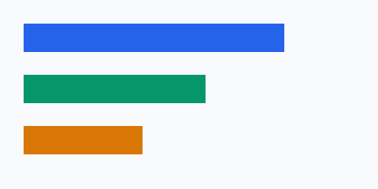
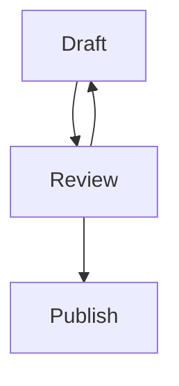

## Code

```go title="main.go" {4-6} /Println/
package main
import "fmt"

func main() {
    fmt.Println("hello")
}
```

### Copy behavior

Copy the original text without line numbers or marker annotations.

## Diagrams and alerts

> [!NOTE]
> This is a note.

> [!TIP]
> Copy the code with the keyboard too.

> [!IMPORTANT]
> Keep the original source in Git.

> [!WARNING]
> A preview is not automatically private.

> [!CAUTION]
> Review external embeds before publishing.

| Feature | State |
| --- | --- |
| Table | Ready |
| ~~Old label~~ | Replaced |

- [x] Write Markdown
- [ ] Review the preview

<details><summary>Raw HTML disclosure</summary><p id="html-anchor">A stable explicit HTML anchor.</p></details>





An inline [ordinary link](https://www.iana.org/domains/reserved) stays a link.
This standalone URL has no cache and must fall back to a hyperlink:

https://www.iana.org/domains/reserved

Footnotes are supported.[^one]

[^one]: A local note, not an external request.

## Related content

<a href="../2026-09-19-protobuf-guide/en.md#field-numbers">Field numbers</a>
