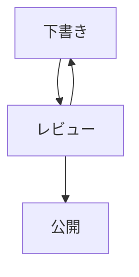

## コード

構文強調と行強調、コピー操作を確認します。コピーは行番号や強調の印を含めず、元のテキストを対象にします。

```go title="main.go" {4-6} /Println/
package main
import "fmt"

func main() {
    fmt.Println("hello")
}
```

### 長い行

横スクロール時もページ全体の幅を壊さないことを確認します。

```text
0123456789 0123456789 0123456789 0123456789 0123456789 0123456789 0123456789 0123456789 0123456789 0123456789 0123456789
```

## 図と注意書き

Mermaid の図、注意書き、表、脚注を確認します。

> [!NOTE]
> これは注記です。

> [!TIP]
> キーボードでもコードをコピーします。

> [!IMPORTANT]
> 元のソースは Git に残します。

> [!WARNING]
> プレビューは、それだけでは非公開になりません。

> [!CAUTION]
> 外部の埋め込みは公開前に確認します。

| 機能 | 状態 |
| --- | --- |
| 表 | 準備完了 |
| ~~古いラベル~~ | 置き換え済み |

- [x] Markdown を書く
- [ ] プレビューを確認する

<details><summary>素の HTML の折りたたみ</summary><p id="html-anchor">明示した HTML アンカーは安定しています。</p></details>




インラインの[普通のリンク](https://www.iana.org/domains/reserved)はリンクのままです。
この単独の URL にはキャッシュがなく、ハイパーリンクへ戻る必要があります。

https://www.iana.org/domains/reserved

脚注に対応しています。[^one]

[^one]: 外部への依頼ではなく、この記事の注です。

## テスト

[Protocol Buffers の記事][proto]へ戻ります。

[proto]: ../2026-09-19-protobuf-guide/ja.md#フィールド番号

## テスト

同じ見出しでも固有のアンカーが必要です。

## 架空の公開パイプラインをレビューする

ここからは長い技術記事の要約と目次を確認するための架空の設計レビューです。対象は、Markdown を Git に保存し、レビューされた内容だけを静的なサイトへ公開する小さなシステムです。実在するサービスの導入事例ではありません。設計を読むときは、どこに正しいデータがあり、どの処理がそのデータを変更できるのかを先に整理します。

### 正しいデータを一つにする

記事の本文と要約は同じ Git の変更として扱います。本文はリポジトリにあるのに要約だけが別のサービスに保存されていると、過去の状態を再現するときに二つの履歴を照合しなければなりません。ここでは公開に使ったコミットを指定すれば、本文、要約、画像をまとめて確認できる構成を考えます。生成物であっても読者に見せる文章はレビュー対象です。

### 生成と検証の順序

新規記事にはまだ要約がありません。その段階で公開用の厳しい検証を実行すると、要約を作る処理へ進めなくなります。一方、要約がないまま公開を許可するのも目的に合いません。作成中の構造検証、要約の生成、公開に必要な項目の検証という順序を明示しておけば、どこで失敗したかを説明できます。前の段階の成功を、後の段階の成功と混同しないことが大切です。

### 人間の編集を守る

自動生成された要約を人間が直したら、その変更には意味があると考えます。本文が変わったという理由だけで再生成すると、表現を整えた作業を失います。そこで生成時の出力ハッシュと現在の要約を比較し、同じときだけ自動更新の候補にします。違っていたら人間が編集したものとして残し、必要なら見直しを促します。ハッシュは文章の品質を測るものではなく、所有権を判断するための手がかりです。

### プレビューの役割

差分の確認と表示の確認は役割が異なります。差分では意図しない文言やリンク先を見つけ、プレビューでは折り返しや見出しの関係、画像の大きさを確認します。パソコンで読めても、幅の狭い画面ではコードブロックがページ全体を押し広げることがあります。暗いテーマで図の文字が背景に埋もれることもあります。本文が同じでも表示条件が違えば確認すべき点は変わります。

### 公開範囲を明示する

プレビューという名前だけで非公開だとは判断できません。認証を求める設定をしたら、普段のブラウザではなく、認証していない状態からアクセスして確かめます。記事のページだけでなく、画像や検索用のデータにも同じ制約がかかる必要があります。ただしリポジトリ自体が公開されていれば、原稿は Git の画面から読めます。どの入口を守っているのかを区別して説明します。

### 再実行できる処理

処理が途中で止まることは例外ではなく、設計時に扱う条件の一つです。同じ入力でもう一度動かしたときに、画像が重複したり日付が勝手に変わったりすると、結果の確認が難しくなります。変更を適用する前に現在のファイルを確認し、前回の出力と一致していなければ競合として扱います。失敗したという事実だけで、利用者が直したファイルを消してやり直すことはしません。

### 検索を利用者の言葉で試す

検索エンジンが日本語に対応しているという説明だけでは、必要な記事が見つかるかは分かりません。本文に書かれた専門用語、普段使う略語、空白を含まない複合語を試します。検索結果の順序を一つに固定するより、上位の候補に必要な記事が含まれるかを確認する方が、改善を受け入れやすくなります。英語の記事が日本語の検索へ混ざっていないことも別に確かめます。

### 公開後に残す記録

公開した時刻だけでは、どの原稿を使ったのか分かりません。コミット識別子と検証結果を残し、前の正常な版へ戻せるようにします。ここで保存したいのは、後から説明するために必要な情報です。利用者の閲覧行動を集めることは、この設計の目的に含めません。記録を増やすほど良いのではなく、何を説明するための記録かを決めます。

## このレビューで残ったこと

この架空のレビューでは、機能の数よりも境界を明確にすることを優先しました。生成する処理と配信する処理、人間の編集と機械が管理する出力、原稿の公開範囲とプレビューの公開範囲をそれぞれ分けています。実装時には、その境界を越えるケースをテストとして残します。要約には、この方針と代表的な例が伝われば十分で、各節の文をすべて詰め込む必要はありません。
