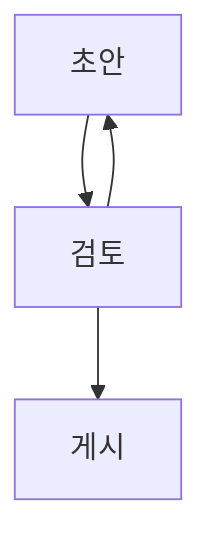

## 코드

구문 강조, 줄 강조와 복사 동작을 확인합니다. 줄 번호나 강조 표시는 빼고 원본 텍스트를 복사해야 합니다.

```go title="main.go" {4-6} /Println/
package main
import "fmt"

func main() {
    fmt.Println("hello")
}
```

### 긴 줄

가로 스크롤이 페이지 전체의 너비를 넓히지 않는지 확인합니다.

```text
0123456789 0123456789 0123456789 0123456789 0123456789 0123456789 0123456789 0123456789 0123456789 0123456789 0123456789
```

## 그림과 알림

Mermaid 다이어그램, 알림, 표와 각주를 확인합니다.

> [!NOTE]
> 이것은 참고 사항입니다.

> [!TIP]
> 키보드로도 코드를 복사해 보세요.

> [!IMPORTANT]
> 원본은 Git에 보관하세요.

> [!WARNING]
> 미리 보기는 자동으로 비공개가 되지 않습니다.

> [!CAUTION]
> 외부 삽입 콘텐츠는 게시 전에 확인하세요.

| 기능 | 상태 |
| --- | --- |
| 표 | 준비됨 |
| ~~이전 이름~~ | 변경됨 |

- [x] Markdown 작성
- [ ] 미리 보기 검토

<details><summary>원시 HTML 접기</summary><p id="html-anchor">명시적으로 지정한 HTML 앵커는 안정적으로 유지됩니다.</p></details>




문장 안의 [일반 링크](https://www.iana.org/domains/reserved)는 링크로 유지됩니다.
아래 단독 URL은 캐시가 없으므로 하이퍼링크로 표시해야 합니다.

https://www.iana.org/domains/reserved

각주를 지원합니다.[^one]

[^one]: 외부 요청이 아니라 이 글 안의 주석입니다.

## 테스트

[Protocol Buffers 글][proto]로 돌아갑니다.

[proto]: ../2026-09-19-protobuf-guide/ko.md#필드-번호

## 테스트

같은 제목에도 서로 다른 앵커가 필요합니다.

## 가상의 게시 파이프라인 검토하기

아래는 요약과 목차를 확인할 수 있도록 작성한 가상의 설계 검토입니다. Markdown을 Git에 저장하고, 검토한 콘텐츠만 정적 사이트에 게시하는 작은 시스템을 다룹니다. 실제 서비스의 사례는 아닙니다. 설계를 읽을 때는 먼저 기준 데이터가 어디에 있는지, 어떤 과정이 그 데이터를 변경할 수 있는지 확인합니다.

### 기준 데이터를 한곳에 두기

글 본문과 요약을 같은 Git 변경으로 취급합니다. 본문은 저장소에 있는데 요약만 다른 서비스에 있으면 과거 상태를 재현하기 위해 두 이력을 맞춰야 합니다. 여기서는 게시에 사용한 커밋으로 본문, 요약, 이미지를 함께 확인할 수 있습니다. 자동 생성한 텍스트라도 독자에게 보여 주는 내용은 검토 대상입니다.

### 생성과 검증의 순서 정하기

새 글에는 아직 요약이 없습니다. 이 단계에서 엄격한 게시 검사를 실행하면 요약을 만드는 과정으로 넘어갈 수 없습니다. 그렇다고 요약 없이 게시하는 것도 목적에 맞지 않습니다. 초안의 구조 검사, 요약 생성, 게시 조건 검사 순서를 명시하면 어느 단계에서 실패했는지 설명할 수 있습니다. 앞 단계의 성공을 다음 단계의 성공으로 여기지 않아야 합니다.

### 사람이 편집한 내용 지키기

자동 생성한 요약을 사람이 수정했다면 그 변경에는 의미가 있습니다. 본문이 바뀌었다는 이유만으로 다시 생성하면 표현을 다듬은 작업을 잃게 됩니다. 생성 당시 출력의 해시와 현재 요약을 비교하고, 완전히 같은 경우에만 자동 갱신 후보로 봅니다. 다르면 사람이 편집한 텍스트로 보존하고 필요할 때 다시 검토하도록 합니다. 해시는 글의 품질을 평가하지 않습니다. 텍스트를 누가 관리하는지 판단하는 단서입니다.

### 미리 보기의 역할

변경 사항과 렌더링된 화면을 확인하는 일은 역할이 다릅니다. 변경 사항에서는 의도하지 않은 문구와 링크 대상을 찾고, 미리 보기에서는 줄바꿈, 제목 관계와 이미지 크기를 확인합니다. 컴퓨터에서 잘 읽히는 페이지도 좁은 화면에서는 코드 블록 때문에 전체 너비가 늘어날 수 있습니다. 어두운 테마에서는 다이어그램 글자가 배경에 묻힐 수도 있습니다. 같은 본문이라도 표시 조건에 따라 필요한 검사가 달라집니다.

### 게시 범위 명시하기

미리 보기라는 이름만으로 비공개라고 판단할 수는 없습니다. 인증이 필요하다면 평소 쓰는 로그인된 브라우저가 아니라 로그아웃 상태에서 확인해야 합니다. 글, 이미지, 검색 데이터에도 같은 보호가 적용되어야 합니다. 하지만 저장소 자체가 공개라면 원고는 Git 호스팅 사이트에서 읽을 수 있습니다. 어떤 진입점을 보호하는지 설명해야 합니다.

### 다시 실행할 수 있는 과정 만들기

작업이 도중에 멈추는 것은 설계에서 고려할 조건입니다. 같은 입력으로 다시 실행했을 때 이미지가 중복되거나 날짜가 바뀐다면 결과를 검토하기 어렵습니다. 변경을 적용하기 전에 현재 파일을 확인하고, 이전 출력과 다르면 충돌로 취급합니다. 실행이 실패했다는 이유만으로 사람이 편집한 파일을 지우고 처음부터 시작해서는 안 됩니다.

### 독자의 표현으로 검색 시험하기

검색 엔진이 어떤 언어를 지원한다고 해서 필요한 글을 찾을 수 있다는 뜻은 아닙니다. 본문에 쓰인 전문 용어, 자주 쓰는 약어와 공백 없는 복합어를 검색해 봅니다. 결과 순서를 하나로 고정하기보다는 필요한 글이 상위 후보에 포함되는지 확인하면 이후 개선도 받아들이기 쉽습니다. 다른 언어의 글이 현재 언어의 검색 결과에 섞이지 않는지도 따로 확인합니다.

### 게시 후 필요한 기록 남기기

게시 시각만으로는 어떤 원고를 사용했는지 알 수 없습니다. 커밋 식별자와 검사 결과를 남겨 이전의 정상 버전으로 돌아갈 수 있게 합니다. 저장하려는 것은 나중에 게시 과정을 설명하는 데 필요한 정보이며, 방문자의 열람 행동은 아닙니다. 기록은 많을수록 좋은 것이 아닙니다. 각 기록이 무엇을 설명할지 정해야 합니다.

## 이번 검토에서 남은 것

이 가상의 검토에서는 기능 목록보다 명확한 경계를 우선했습니다. 생성 과정과 전달 과정, 사람의 편집과 기계가 관리하는 출력, 원고의 공개 범위와 미리 보기의 공개 범위를 구분합니다. 구현할 때는 그 경계를 넘는 사례를 테스트로 남깁니다. 요약에는 이 방침과 대표적인 예가 전달되면 충분하며, 각 절의 모든 문장을 담을 필요는 없습니다.
