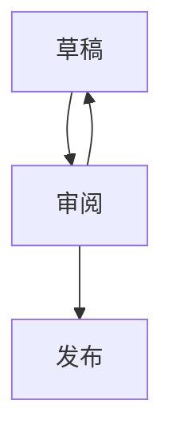
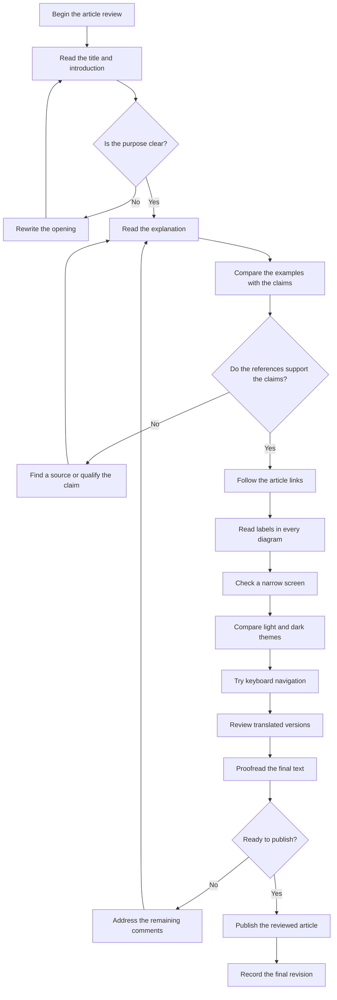
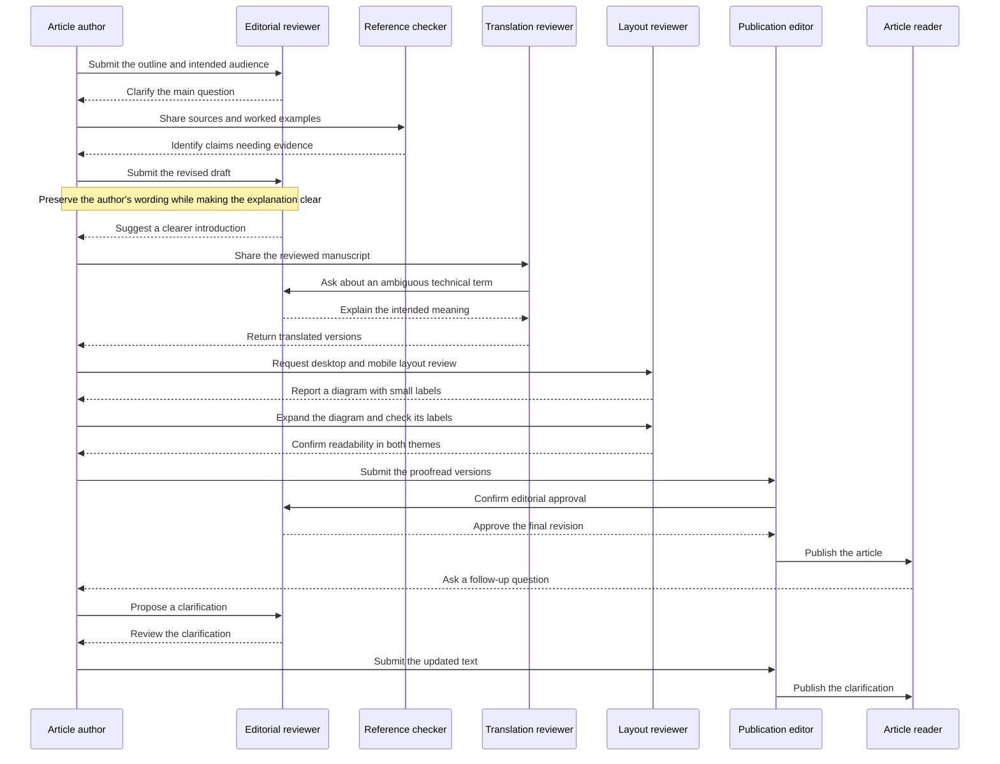

## 代码

检查语法高亮、行高亮和复制操作。复制的内容应是原始文本，不包含行号或高亮标记。

```go title="main.go" {4-6} /Println/
package main
import "fmt"

func main() {
    fmt.Println("hello")
}
```

### 长行

检查横向滚动不会撑宽整个页面。

```text
0123456789 0123456789 0123456789 0123456789 0123456789 0123456789 0123456789 0123456789 0123456789 0123456789 0123456789
```

## 图与提示

检查 Mermaid 图、提示框、表格和脚注。

> [!NOTE]
> 这是一条注记。

> [!TIP]
> 也可以用键盘复制代码。

> [!IMPORTANT]
> 将原始内容保存在 Git 中。

> [!WARNING]
> 预览并不会自动变成私有页面。

> [!CAUTION]
> 发布前请检查外部嵌入内容。

| 功能 | 状态 |
| --- | --- |
| 表格 | 已就绪 |
| ~~旧标签~~ | 已替换 |

- [x] 编写 Markdown
- [ ] 检查预览

<details><summary>原生 HTML 折叠内容</summary><p id="html-anchor">显式指定的 HTML 锚点保持稳定。</p></details>




## 大型 Mermaid 图表

这些图表展示一个虚构的编辑流程。展开每张图表阅读标签，滚动到边缘，并比较适应窗口和实际大小。也请试用缩放、全屏、窄屏以及明暗主题。点击关闭按钮或按 Escape 键返回文章。

各语言版本的图表使用相同的英文标签，便于比较布局。

### 横向的发布流程

```mermaid
flowchart LR
  Idea["Choose an article idea"] --> Outline["Write the outline"]
  Outline --> Research["Collect sources and examples"]
  Research --> Draft["Write the first draft"]
  Draft --> Review["Ask for an editorial review"]
  Review --> Revise["Revise the explanation"]
  Revise --> Check["Check facts and references"]
  Check --> Translate["Prepare translated versions"]
  Translate --> Proof["Proofread every version"]
  Proof --> Layout["Review the page layout"]
  Layout --> Publish["Publish the article"]
  Publish --> Archive["Keep the reviewed manuscript"]
```



### 纵向的审核清单



### 详细的编辑对话



行内的[普通链接](https://www.iana.org/domains/reserved)仍然显示为链接。
下面的独立 URL 没有缓存元数据，应回退为超链接。

https://www.iana.org/domains/reserved

支持脚注。[^one]

[^one]: 这是本文的本地注释，不会发起外部请求。

## 测试

返回 [Protocol Buffers 文章][proto]。

[proto]: ../2026-09-19-protobuf-guide/zh-Hans.md#字段编号

## 测试

相同的标题也需要各自独立的锚点。

## 审阅一个虚构的发布流程

下面是一份虚构的设计审阅，篇幅足以检查摘要和目录。讨论的系统将 Markdown 存入 Git，并且只将经过审阅的内容发布到静态网站。它不是任何真实服务的案例。阅读设计时，先找出数据的唯一来源，以及哪些过程可以修改这些数据。

### 保持唯一的数据来源

把正文和摘要作为同一次 Git 变更处理。如果正文在仓库中，而摘要只保存在另一个服务里，重现历史状态就需要核对两套记录。在这里，通过发布所使用的提交，就能一起查看正文、摘要和图片。即使文字由机器生成，只要要展示给读者，就需要审阅。

### 明确生成与验证的顺序

新文章还没有摘要。如果此时运行严格的发布检查，就会阻止生成摘要的过程；允许没有摘要的文章直接发布，也不符合目标。明确顺序：起草时进行结构检查，然后生成摘要，最后检查发布所需的条件。这样就能解释失败发生在哪个阶段。前一阶段成功并不代表后一阶段成功。

### 保留人工修改

当作者修改自动生成的摘要时，这些改动应受到尊重。仅仅因为正文变化就重新生成，会丢失润色文字的成果。比较生成时的输出哈希与当前摘要，只在完全一致时将其视为可自动更新的候选。如果两者不同，就保留人工编辑的文本，必要时提示再次审阅。哈希不是写作质量的评分，只是判断文本由谁维护的线索。

### 预览的用途

查看差异和查看页面各有作用。差异可以发现意外的措辞或链接目标，预览则用于检查换行、标题关系和图片尺寸。电脑上容易阅读的页面，在窄屏上仍可能被代码块撑宽。深色主题中的图中文字也可能融入背景。同一份正文在不同显示条件下，需要不同的检查。

### 说明发布边界

“预览”这个名称本身不代表私有。如果要求身份验证，就应从未登录的浏览器进行检查，而不是使用日常已登录的浏览器。文章、图片和搜索数据都需要相同的保护。不过，如果仓库本身公开，读者仍然可以从 Git 托管平台阅读原稿。要说明保护的是哪个入口。

### 让流程可以重复执行

流程中途停止是设计需要考虑的情况。如果对同一输入再次运行会产生重复图片，或自动改变日期，结果就很难检查。应用变更前先查看当前文件；如果它与之前的输出不同，就按冲突处理。不能仅仅因为一次运行失败，就删除作者编辑过的文件并从头开始。

### 用读者的词语测试搜索

搜索引擎声称支持某种语言，并不保证能找到所需文章。试试正文中的专业术语、常用缩写，以及没有空格的复合词。与其固定唯一的结果顺序，不如检查目标文章是否出现在靠前的候选中，这样也更容易接受后续改进。还应单独确认其他语言的文章不会混入当前语言的搜索结果。

### 发布后保留必要记录

发布时间无法说明使用了哪份原稿。保留提交标识和检查结果，就能回到之前的正常版本。需要保存的是日后解释发布过程所必需的信息，而不是访客的浏览行为。记录越多并不一定越好，应先明确每条记录要解释什么。

## 这次审阅留下的问题

这份虚构审阅优先考虑清晰的边界，而不是更长的功能列表。它区分生成与交付、人工修改与机器维护的输出，以及原稿与预览各自的公开范围。实现时，应保留跨越这些边界的测试案例。摘要只需要表达这一方针和一个代表性例子，不必塞入每个章节的全部句子。
